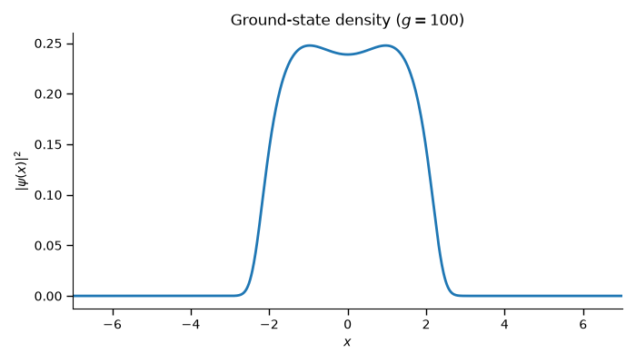

# 1D Bose-Einstein Condensate

<p align="center">
  
</p>


## Overview
This project presents a numerical implementation of the one-dimensional Gross–Pitaevskii equation to compute the ground state of a Bose–Einstein condensate (BEC). The solution is obtained through imaginary-time evolution using the Split-Step Fourier method, a widely used algorithm for nonlinear quantum systems. The resulting condensate density is then visualized, allowing users to explore the effects of different interaction strengths.

## Features

* Numerical solution of the one-dimensional Gross–Pitaevskii equation.
* Ground-state calculation via imaginary-time evolution.
* Split-Step Fourier method implementation.
* Fast Fourier Transform (FFT)-based kinetic propagation.
* Simple command-line interface for running simulations.


## Physics Background

A weakly interacting one-dimensional Bose–Einstein condensate (BEC) is described by the time-independent Gross–Pitaevskii equation,

$$
\mu \psi(x)=
-\frac{1}{2}\frac{d^2\psi}{dx^2}
+V(x)\psi
+g|\psi(x)|^2\psi,
$$

where $\mu$ is the chemical potential, $g$ is the interaction strength, and $V(x)$ is the external trapping potential. In this project, we consider a double-well potential,

$$
V(x)=x^4-2x^2.
$$

The goal is to compute the ground-state wave function $\psi(x)$, from which the condensate density can be obtained as

$$
\rho(x)=|\psi(x)|^2.
$$

The ground state is computed numerically through **imaginary-time evolution** using the **Split-Step Fourier method**, which efficiently alternates between the kinetic and potential contributions while renormalizing the wave function after each iteration until convergence.


## Repository Structure

```text
.
├── notebooks/
│   └── bec_1D.ipynb        # Main notebook with the numerical implementation
├── results/
│   └── bec_density.png     # Example output
├── src/
│   ├── grid.py             # Spatial grid generation
│   ├── physics.py          # Physical model and helper functions
│   ├── plotting.py         # Visualization utilities
│   └── solver.py           # Split-Step Fourier solver
├── .gitignore
├── main.py                 # Command-line interface
├── README.md
└── requirements.txt
```

## Installation

Clone the repository and install the required dependencies:

```bash
pip install -r requirements.txt
```
## Usage

Run the program from the project:

```bash
python main.py
```

Select **Plot BEC density**, enter the desired interaction strength $g$, and the program will compute the condensate ground state and display its particle density.

## Example

After running

```bash
python main.py
```

the program displays the following menu:

```text
========== 1D Bose-Einstein Condensate ==========
1. Plot BEC density
2. Exit
```

Select the first option:

```text
Select an option: 1
```

Then enter the interaction strength:

```text
Interaction strength g = 100
```

The program computes the ground-state wave function using imaginary-time evolution and displays the resulting particle density:

<p align="center">
  
</p>


---

**Author:** Nicolás Jiménez Coria